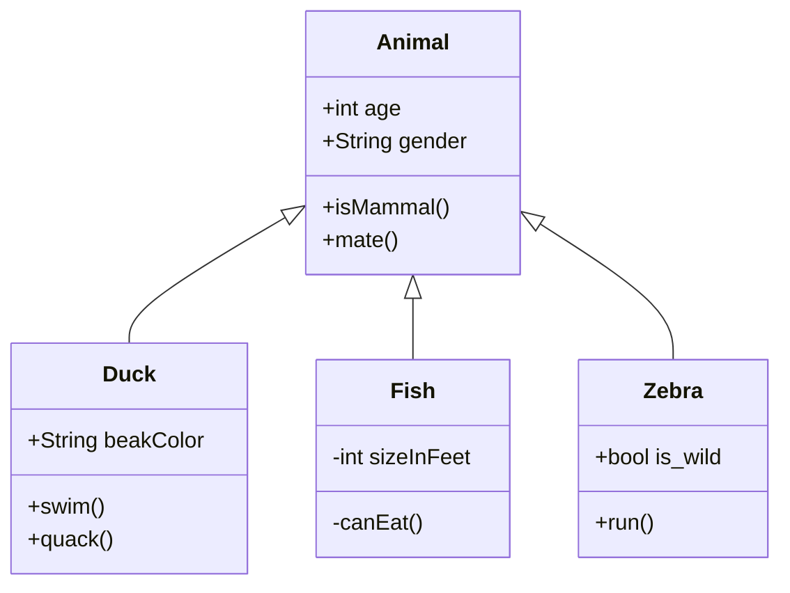

---
title: Animal example
---

```mermaid
classDiagram
    class Duck{
        +String beakColor
        +swim()
        +quack()
    }
    class Fish{
        -int sizeInFeet
        -canEat()
    }
    class Zebra{
        +bool is_wild
        +run()
    }
    class Animal{
        +int age
        +String gender
        +isMammal()
        +mate()
    }

    Animal <|-- Duck
    Animal <|-- Fish
    Animal <|-- Zebra
```

    Animal : +int age
    Animal : +String gender
    Animal: +isMammal()
    Animal: +mate()